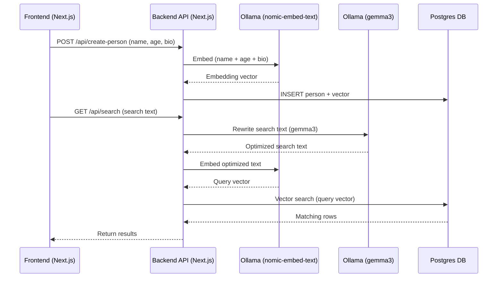

# OllamaVector

OllamaVector is a full-stack application demonstrating semantic search and embedding workflows using Next.js, Ollama (with nomic-embed-text and gemma3 models), and Postgres with vector search capabilities. The app enables creation of person records with embedded vectors and supports semantic search via natural language queries, automatic query rewriting, and vector similarity search in the database.

## What are Embeddings and RAG Models?

**Embeddings** are mathematical representations of text, numbers, or other data types as high-dimensional vectors. These vectors capture the semantic meaning of the input, allowing similar pieces of information to be located near each other in vector space. Embeddings make it possible to compare, search, or cluster data based on meaning rather than exact matches.

**RAG (Retrieval-Augmented Generation) models** combine large language models (LLMs) with information retrieval. In a typical RAG workflow, user queries are first used to retrieve relevant context (using embeddings and vector search) from a knowledge base or database. The language model then generates responses using both the query and the retrieved context, leading to more accurate and informed answers.

## System Architecture



## Getting Started

First, run the development server:

```bash
npm run dev
# or
yarn dev
# or
pnpm dev
# or
bun dev
```

Open [http://localhost:3000](http://localhost:3000) with your browser to see the result.

You can start editing the page by modifying `app/page.tsx`. The page auto-updates as you edit the file.

## Learn More

- [Next.js Documentation](https://nextjs.org/docs) - learn about Next.js features and API.
- [Learn Next.js](https://nextjs.org/learn) - an interactive Next.js tutorial.

## Deploy on Vercel

The easiest way to deploy your Next.js app is to use the [Vercel Platform](https://vercel.com/new?utm_medium=default-template&filter=next.js&utm_source=create-next-app&utm_campaign=create-next-app).

Check out the [Next.js deployment documentation](https://nextjs.org/docs/app/building-your-application/deploying) for more details.
